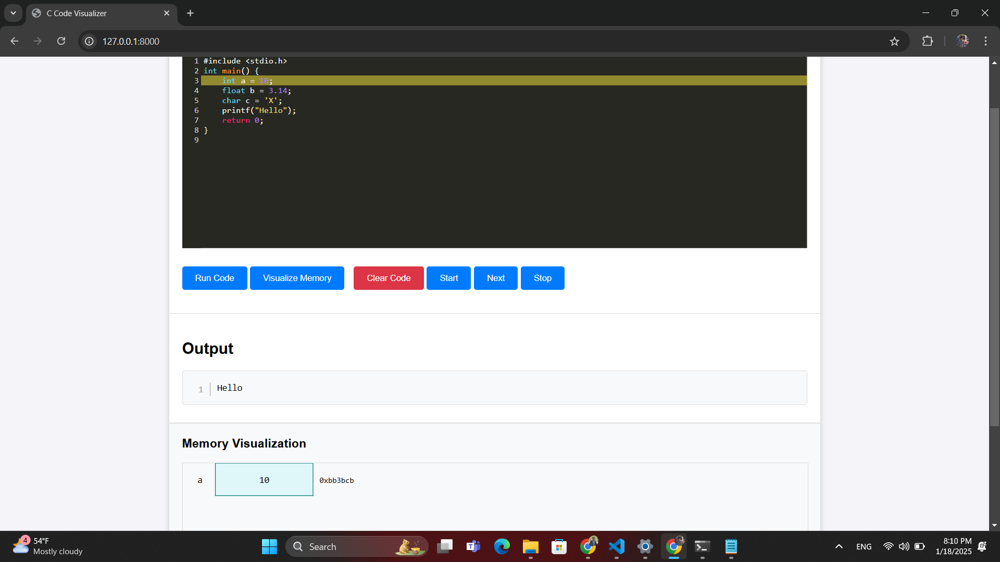
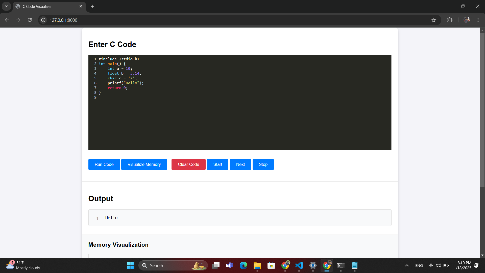

# Project Title

C Code Visualizer is a web-based application that allows users to interactively visualize C code execution. Users can step through their code line by line, view memory allocation, and understand how variables and values change during execution.


## Features

- Interactive stepping through C code
- Visualize memory: variable names, values, and addresses
- Error feedback for compilation and runtime issues

## Installation

Install c_code_visualizer with Django

```bash
    git clone https://github.com/pravinsang/c_code_visualizer.git
    cd c_code_visualizer
    pip install -r requirements.txt
    python manage.py migrate
    python manage.py runserver
    Open your browser and navigate to http://127.0.0.1:8000
```
    ## Usage

### Writing and Running Code
1. **Enter your C code**: Use the editor on the homepage to write your C code.
2. **Run or Visualize**:
   - Click **Run Code** to compile and execute your code.
   - Click **Visualize Memory** to start a debugging session and analyze memory.

### Debugging
1. **Start Debugging**: Click the **Start Debugging** button to initialize a debugging session.
2. **Step Through Code**:
   - Use the **Next Step** button to execute your code line by line.
   - Watch the memory visualization update in real-time.
3. **Stop Debugging**: Click the **Stop Debugging** button to terminate the debugging session.

## API Reference
| API Endpoint       | HTTP Method | Description                |
| :----------------- | :---------: | :------------------------- |
| `/start_debugging` | POST        | Starts a debugging session |
| `/step_forward`    | POST        | Moves to the next step     |
| `/stop_debugging`  | POST        | Stops the debugging session|

#### Example JavaScript Call
```javascript
fetch('/start_debugging', {
  method: 'POST',
  headers: {
    'Content-Type': 'application/json',
  },
  body: JSON.stringify({ c_code: 'int a = 10; printf("%d", a);' }),
})
  .then(response => response.json())
  .then(data => console.log(data))
  .catch(error => console.error(error));


## Folder Structure

c_code_visualizer/
│
├── manage.py                         # Django project management script
├── db.sqlite3                        # Database file (if you're using Django's default SQLite)
├── README.md                         # Project documentation
│
├── visualize_code/                   # Main app folder
│   ├── __init__.py                   # Python package marker
│   ├── admin.py                      # Admin configurations for the app (optional)
│   ├── apps.py                       # App configuration
│   ├── helpers/                      # Helper functions and utilities
│   │   ├── __init__.py               # Python package marker for helpers
│   │   ├── gdb_helpers.py            # Functions related to GDB interactions
│   │   └── memory_helpers.py         # Memory visualization helpers
│   ├── migrations/                   # Django migration files for models
│   │   └── __init__.py               # Migration initialization
│   ├── models.py                     # Data models (if needed, can be empty if not used)
│   ├── templates/                    # HTML templates for rendering views
│   │   ├── home.html                 # Main homepage template
│   ├── tests.py                      # Unit tests for your app
│   ├── urls.py                       # URL routing for your app's views
│   ├── views.py                      # View functions for handling requests
│   └── __pycache__/                  # Auto-generated Python bytecode files
│
├── static/                           # Static files (CSS, JS, images)
│   ├── css/                          # Stylesheets
│   │   └── style.css                 # Your CSS files (e.g., style.css)
│   ├── js/                           # JavaScript files
│   │   ├── update_memory.py                       
│   │   └── main.js                   # JavaScript for frontend (e.g., main.js
└── .vscode/                          # Visual Studio Code workspace settings
    └── settings.json                 # VS Code settings for the project

## Screenshots

## Screenshots

### Homepage


### Debugger View
